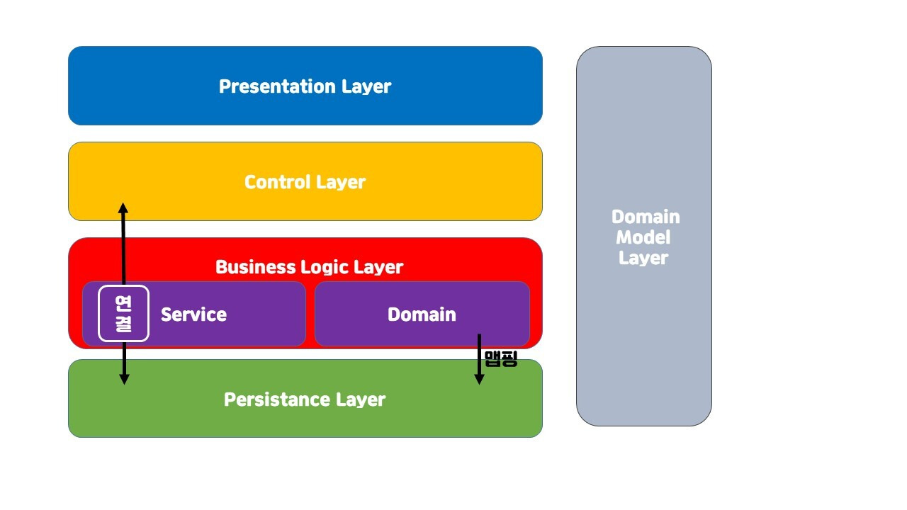

## 💡 배운 점

### try-catch vs if 에러처리
- **try-catch**
  - 코드 실행 중 예상치 못한 에러가 발생해도 프로그램이 즉시 종료되지 않고 처리 가능
  - 구체적인 예외처리 가능
  - 에러가 발생할 가능성이 있는 코드를 명확하게 구분하므로 코드 가독성 증가
  - 에러 발생 시 스택 추적이 발생하여 성능에 영향 가능성 존재
- **if**
  - 입력값 확인 및 논리 조건 체크에 유용
  - try-catch에 비해 스택 추적을 사용하지 않아 성능면에서 유리
  - if 문 만으로 처리 불가능한 예외 상황이 존재
- **결론**
  - 상황에 맞게 알잘딱하게 써라

### parseStringTryCount 클래스에서는  어떻게 에러처리를 할까?
- parseStringTryCount 클래스는 사용자에게 받은 string 타입의 number 값을 number 형태로 parse하는 클래스다.
- 이 과정으로 발생 가능한 에러는 NumberFormatException e(런타입 에러) 자바스크립트의 NaN 타입 에러와 같다.
- 에러처리를 위해 if(match.regex) 를 통해 예외 발생 가능성을 줄일 수 있으나, 실제로 에러를 반환하지는 못한다.
- 즉 try-catch를 사용하여 에러를 처리해야 함.

### interface를 활용한 다형성 확보
- interface를 사용하면 여러 클래스가 동일한 메서드를 각자의 방식으로 구현 가능하다.
```java
// 기존 코드
public int getRandomNumber(){
    return (int) (Math.random() * 10); 
}
```
```java
// interface 적용한 경우
public interface RandomNumberGenerator {
  int getRandomNumber();
}

public class GetZeroToNineRandomNumber implements RandomNumberGenerator{
  @Override
  public int getRandomNumber(){
    return (int) (Math.random() * 10);
  }
}
```
- **왜 interface를 사용하는걸까?**
  - interface는 껍데기다. 프로그램에게 interface를 통해 getRandomNumber() 메서드의 존재를 알게 한다.
  - 실제 구현 클래스 GetZeroToNineRandomNumber를 통해 getRandomNumber() 메서드를 작성한다.
  - 만약 제작 중에 다양한 경우의 난수를 출력해야하는 경우에 @Override를 통해 여러 클래스의 객체를 작성할 수 있다.
  - 즉, **다형성**을 통해 RandomNumberGenerator interface 타입으로 여러 클래스의 객체를 사용 가능해진다.
  - **다형성**은 같은 타입의 객체가 다양한 형태로 동작할 수 있게 하는 특성을 의미한다.

### 중첩 클래스에서 static 키워드의 활용
- static으로 선언된 클래스 멤버(필드, 메서드, 중첩 클래스 등..)은 인스턴스가 아닌 클래스 자체에 속하게 된다.
- 즉, 인스턴스를 정의하지 않고 직접 접근이 가능해진다.
- 독립적인 기능을 수행하는 클래스를 외부 클래스 안에 논리적으로 묶어 둘 때 유용

### util 패키지로 interface 관리
- domain에서 외부 클래스를 호출하게 되면 domain 패키지에 종속성이 생긴다.
- 외부 클래스를 domain의 형제로 관리하기 위해 controller에서 사용하자.

### domain 메서드의 종속성과 처리 방법
- domain의 메서드 중 강한 결속을 가진 메서드가 존재한다고 가정하자.
```java
// domain
public int getCarMoveState(int randomNumber){
    if(randomNumber >= 4){
        return 1;
    }

    return 0;
}

public String isCarMoved(int moveState){
    if(moveState == 1){
        return "move";
    }

    return "stop";
}
```
- 이 예시에서는 getCarMoveState의 반환값이 isCarMoved 메소드의 인자다. 즉 두 메서드는 강한 결속과 종속성을 가진다.
- 이 경우에 메서드를 process 하는 방법은 두 가지가 존재한다.
```java
// domain
public String processCarMove(int randomNumber){
    int moveState = getCarMove(randomNumber);
    return isCarMoved(moveState);
}
```
- 하나는 domain에서 강한 결속을 가진 두 메서드를 처리하는 메서드를 추가하면서 domain의 캡슐화를 강하게 유지하는 방법이다.
- 이 경우엔 domain의 메서드가 서로의 존재와 역할을 알게 된다.
```java
// controller
public void runCar(){
// ,,,
  int randomNumber = zeroToNineGenerator.getRandomNumber();

  int moveState = racingCarLogic.getCarMoveState(randomNumber);
  String isCarMoved = racingCarLogic.isCarMoved(moveState);
  
// ,,,
}
```
- 다른 하나는 controller에서 직렬적으로 두 메서드를 처리하는 것이다. 이 경우에느 domain이 메서드가 서로의 존재를 모르게 할 수 있다.

### MVC pattern with service layer

- **controller**
  - 사용자 요청 처리해서 service 계층으로 보내기
  - view로 결과 보내기
  - application의 전체적인 동작 제어
- **service**
  - controller에서 받은 데이터 작업 수행
  - domain / database와 상호작용
- **domain**
  - 비지니스 규칙, 도메인 모델 정의
  - service에서 호출되며, 실제 로직을 정의하는 계층
- **view**
  - 사용자에게 데이터 표시

### DTO, DAO, VO
- **DTO**
  - `client(view) -> controller`
    `controller -> service`
    `service -> controller -> client` `...others`
  - 설계에 따라 다양하게 사용 가능함.
  - 요점은 DTO가 무결한 데이터 전송을 위해 사용한다는 것
  - 고로, 도메인 로직을 DTO 내부에서 사용하는 것은 불가
- **DAO**
  - database와의 상호작용. 
  - CRUD(create, read, update, delete) 작업 처리
  - 주로 service와 database 사이에 위치
- **VO**
  - domain 계층에서 데이터를 `불변 객체`로 사용
  - 값 변경이 필요한 경우 새로운 VO 생성 필요
  - 도메인 규칙이 VO에 캡슐화되어 사용됨
  - service나 domain에서 사용

### MVC 5 Layer Pattern


- **Presentation Layer**
  - fronted
- **Control Layer**
  - 요청 흐름 제어
- **Business Logic Layer**
  - `Service Layer`, `Domain Layer` 가 여기 포함됨
- **Persistence Layer**
  - db와 상호작용 
  - CRUD
  - DAO
  - infrastructure layer는 persistence를 포함하는 더 넓은 범위
    - persistence가 db와의 상호작용에 집중한다면 infrasturucture는 앱 외부 모든 연결에 관여
- **Domain Model Layer**
  - 데이터와 비즈니스 규칙 정의
  - domain layer와 협업